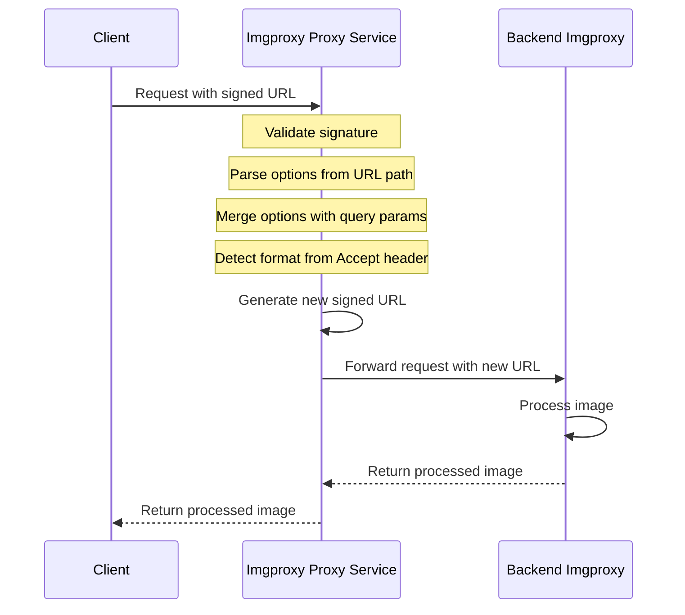
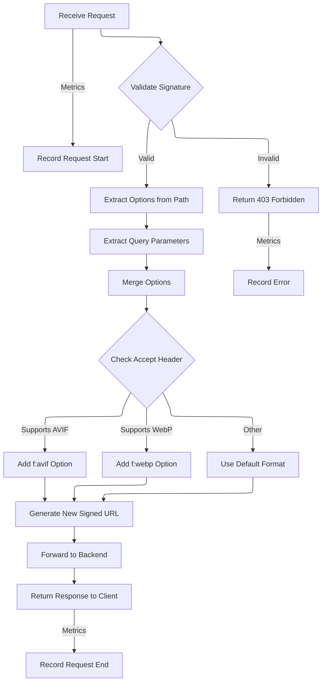

# Imgproxy Proxy

The project starts on 02-05-2025.

 [](https://codecov.io/gh/soranoo/imgproxy-proxy) [](LICENSE)&nbsp;&nbsp;&nbsp;[](https://github.com/soranoo/Donation)

This service acts as a secure proxy in front of an [imgproxy](https://imgproxy.net/) instance. It provides enhanced security through URL signing and allows for dynamic image option adjustments based on client capabilities and request parameters.

## 🎯 Use Cases

* **Next.js Image Optimization** - Instead of using Next.js' built-in api to sign and fetch images which may cause high bandwidth usage to the edge, you can use this proxy to sign and fetch images from your own imgproxy instance. This avoids the need to send large images to the edge and then back to your server, which can be inefficient and costly.

## ⚙️ How it Works

The proxy intercepts incoming image requests, validates their signatures, modifies processing options if necessary, generates a new signed URL for the backend imgproxy service, and forwards the request.

**Request Flow:**



**Processing Workflow:**



**Key Features:**

* **Secure URLs:** Uses HMAC-SHA256 signatures (key and salt) to prevent URL tampering.
* **Dynamic Options:** Merges options specified in the URL path with query parameters (query parameters take precedence).
* **Content Negotiation:** Automatically selects the best image format (AVIF, WebP, JPG, PNG) based on the client's `Accept` header and adds the corresponding `f:` option.
* **Prometheus Metrics:** Comprehensive metrics for monitoring request counts, latencies, and error rates.
* **Standardized Logging:** Structured logging with configurable log levels.
* **Configuration:** Configured entirely through environment variables.

## 📊 Monitoring and Observability

### 📈 Prometheus Metrics

The service exposes Prometheus metrics at the `/metrics` endpoint (configurable), which can be scraped by Prometheus to monitor:

| Metric Name                             | Type      | Description                                                                                                                             | Labels         |
| :-------------------------------------- | :-------- | :-------------------------------------------------------------------------------------------------------------------------------------- | :------------- |
| `requests_total`                        | Counter   | Total number of image proxy requests processed.                                                                                         | `status`, `path` |
| `request_duration_seconds`              | Histogram | Duration of image proxy requests in seconds. Buckets: 0.01, 0.05, 0.1, 0.25, 0.5, 1, 2.5, 5, 10.                                         | `status`, `path` |
| `requests_in_progress`                  | Gauge     | Current number of image proxy requests being processed.                                                                                 | `path`         |
| `backend_errors_total`                  | Counter   | Total number of backend errors encountered during image proxying (e.g., request creation, backend request failure, response copy error). | `type`         |
| `signature_errors_total`                | Counter   | Total number of signature validation errors (e.g., invalid signature, path parsing error).                                              | `type`         |

*(Note: The actual metric names will be prefixed with the configured `METRICS_NAMESPACE`, which defaults to `imgproxy_proxy`)*.

Example Prometheus configuration:

```yaml
scrape_configs:
  - job_name: 'imgproxy-proxy'
    scrape_interval: 15s
    static_configs:
      - targets: ['imgproxy-proxy:8080']
```

### 📝 Structured Logging

The service implements structured logging with configurable log levels:

* **DEBUG (0):** Detailed information for debugging.
* **INFO (1):** General information about service operation (default).
* **WARN (2):** Warning conditions that should be addressed.
* **ERROR (3):** Error conditions that don't cause service failure.
* **FATAL (4):** Critical errors that cause the service to stop.

## ⚡ Configuration

The service requires the following environment variables:

| Variable              | Description                                                                 | Default | Required |
| --------------------- | --------------------------------------------------------------------------- | ------- | -------- |
| `IMGPROXY_KEY`        | Hex-encoded key for HMAC signing.                                           |         | Yes      |
| `IMGPROXY_SALT`       | Hex-encoded salt for HMAC signing.                                          |         | Yes      |
| `IMGPROXY_BASE_URL`   | The base URL of the backend imgproxy instance (e.g., `http://localhost:8081`). |         | Yes      |
| `IMGPROXY_SECRET`     | Authorization token for backend imgproxy instance. Will be sent as `Authorization: Bearer %secret%` header. |         | No       |
| `IMGPROXY_ENCODE`     | Whether to Base64 encode the source URI (`true` or `false`).                | `true`  | No       |
| `IMGPROXY_SIGNATURE_SIZE` | The desired length of the signature in bytes (max 32).                      | `32`    | No       |
| `METRICS_ENABLED`     | Whether to enable Prometheus metrics.                                       | `true`  | No       |
| `METRICS_ENDPOINT`    | The endpoint where Prometheus metrics are exposed.                          | `/metrics` | No    |
| `METRICS_NAMESPACE`   | Namespace prefix for all Prometheus metrics.                                | `imgproxy_proxy` | No |
| `LOG_LEVEL`           | Log level (0=DEBUG, 1=INFO, 2=WARN, 3=ERROR, 4=FATAL).                      | `1`     | No       |
| `SERVER_PORT`         | Port on which the server listens.                                           | `:8080` | No       |

A `.env.sample` file is included in the repository that you can use as a template for your own configuration:

```bash
# On Linux/Mac
cp .env.sample .env
# Edit the .env file with your preferred editor
nano .env

# On Windows
copy .env.sample .env
# Edit the .env file with your preferred editor
```

Alternatively, you can also use this command to create your `.env` file from the sample:

```bash
# On Linux/Mac
eval "echo \"$(cat .env.sample)\"" > .env

# On Windows PowerShell
Get-Content .env.sample | ForEach-Object {$_ -replace "=.*", "=your-value-here"} | Set-Content .env
```

Example `.env` file contents:

```
# Required environment variables
IMGPROXY_KEY=0123456789abcdef0123456789abcdef0123456789abcdef0123456789abcdef
IMGPROXY_SALT=0123456789abcdef0123456789abcdef0123456789abcdef0123456789abcdef
IMGPROXY_BASE_URL=http://imgproxy:8080

# Optional environment variables
IMGPROXY_ENCODE=true
IMGPROXY_SIGNATURE_SIZE=32
METRICS_ENABLED=true
METRICS_ENDPOINT=/metrics
METRICS_NAMESPACE=imgproxy_proxy
LOG_LEVEL=1
SERVER_PORT=:8080
```

## 📁 Project Structure

This project follows the standard Go project layout:

```
.
├── cmd/
│   └── server/
│       └── main.go         # Application entry point
├── internal/
│   ├── logging/
│   │   ├── logging.go      # Standardized logging utilities
│   │   └── logging_test.go # Tests for logging package
│   ├── metrics/
│   │   ├── metrics.go      # Prometheus metrics collection
│   │   └── metrics_test.go # Tests for metrics package
│   └── proxy/
│       ├── config.go       # Configuration handling
│       ├── handler.go      # HTTP request handlers
│       └── url.go          # URL processing functions
├── pkg/
│   └── signing/
│       └── sign.go         # URL signing utilities
├── Dockerfile
└── docker-compose.yml
```

## 🚀 Usage

1. **Set Environment Variables:** Configure the required variables listed above.
2. **Run the Service:**

    ```bash
    go run cmd/server/main.go
    ```

    The service will start on port `8080` (or as configured by `SERVER_PORT`).

    **Run Tests:**

    ```bash
    # Run all tests
    go test ./...

    # Run tests with coverage
    go test -cover ./...

    # Run tests for a specific package
    go test ./pkg/signing
    go test ./internal/proxy
    go test ./internal/metrics
    go test ./internal/logging
    ```

    **Docker:**

    ```bash
    # Build the Docker image
    docker build -t imgproxy-proxy .

    # Run the container
    docker run -p 8080:8080 \
      -e IMGPROXY_KEY=your_key_here \
      -e IMGPROXY_SALT=your_salt_here \
      -e IMGPROXY_BASE_URL=http://your-imgproxy-instance:8081 \
      imgproxy-proxy
    ```

    **Docker Compose:**

    A Docker Compose configuration is provided to run both the proxy service and imgproxy together:

    ```bash
    # Create a .env file with your key and salt
    echo "IMGPROXY_KEY=your_key_here" > .env
    echo "IMGPROXY_SALT=your_salt_here" >> .env
    
    # Start the services
    docker-compose up -d
    
    # To stop the services
    docker-compose down
    ```

    This will:
    * Start the proxy service on port 8080
    * Start imgproxy as a backend service
    * Configure both with the same key and salt
    * Mount a local `./images` directory for serving local files

3. **Make Requests:**
    Construct URLs in the format:
    `http://<proxy_host>:8080/{signature}/{options}/{encoded_uri}`

    * `{signature}`: The URL-safe Base64 encoded HMAC-SHA256 signature calculated using the key, salt, and the path `/{options}/{encoded_uri}`.
    * `{options}`: Optional imgproxy processing options (e.g., `w:500/h:300`).
    * `{encoded_uri}`: The URL-safe Base64 encoded source image URI (if `IMGPROXY_ENCODE=true`) or `plain/<plain_uri>` (if `IMGPROXY_ENCODE=false`).

    You can also add query parameters like `?w=100&h=50&q=80` to override or add options. The service will merge these with path options and the format option derived from the `Accept` header before generating the final URL for the backend imgproxy.

    **Accepted Query Parameters:**

    | Parameter | Description |
    |-----------|-------------|
    | `w` | Width in pixels |
    | `h` | Height in pixels |
    | `q` | Quality (1-100) |

    **Example Request:**

    Let's assume:
    * Proxy is running at `http://localhost:8080`.
    * Backend imgproxy is at `http://imgproxy:8081`.
    * `IMGPROXY_KEY` and `IMGPROXY_SALT` are configured.
    * `IMGPROXY_ENCODE=true`.
    * Source image URL is `https://example.com/images/cat.jpg`.
    * The client sends an `Accept: image/webp,image/avif,image/*;q=0.8` header.

    1. **Client Request:** The client wants a 300px image with quality 75.
        * Path to sign: `/w:300/q:75/aHR0cHM6Ly9leGFtcGxlLmNvbS9pbWFnZXMvY2F0LmpwZw` (options + base64 encoded URL)
        * Calculate signature `S` based on the path, key, and salt.
        * Client sends request: `GET http://localhost:8080/S/w:300/q:75/aHR0cHM6Ly9leGFtcGxlLmNvbS9pbWFnZXMvY2F0LmpwZw` with the `Accept` header.

    2. **Proxy Processing:**
        * Receives the request.
        * Validates signature `S` against `/w:300/q:75/aHR0cHM6Ly9leGFtcGxlLmNvbS9pbWFnZXMvY2F0LmpwZw`. (Assume valid).
        * Extracts path options: `w:300`, `q:75`.
        * Extracts encoded source URL: `aHR0cHM6Ly9leGFtcGxlLmNvbS9pbWFnZXMvY2F0LmpwZw`.
        * Checks query parameters (none in this example).
        * Checks `Accept` header: Detects `image/webp` is preferred and supported.
        * Merges options: `w:300`, `q:75`, `f:webp`.
        * Constructs the path for the backend: `/f:webp/w:300/q:75/aHR0cHM6Ly9leGFtcGxlLmNvbS9pbWFnZXMvY2F0LmpwZw`.
        * Calculates a *new* signature `S'` for this backend path using the *same* key and salt.
        * Generates the final backend URL: `http://imgproxy:8081/S'/f:webp/w:300/q:75/aHR0cHM6Ly9leGFtcGxlLmNvbS9pbWFnZXMvY2F0LmpwZw`.

    3. **Backend Request & Response:**
        * Proxy forwards the request to `http://imgproxy:8081/S'/f:webp/w:300/q:75/aHR0cHM6Ly9leGFtcGxlLmNvbS9pbWFnZXMvY2F0LmpwZw`.
        * Backend imgproxy validates signature `S'`, processes the image according to the options (`f:webp`, `w:300`, `q:75`), and returns the resulting WebP image.
        * Proxy streams the image response back to the client.

    **Example Request with Query Parameters:**

    Let's use the same setup as above, but the client adds query parameters to override the width and quality.

    1. **Client Request:** The client wants a 200px wide image with quality 90. The path options specify 300px width and quality 75, but the query parameters will override these.
        * Path to sign: `/w:300/q:75/aHR0cHM6Ly9leGFtcGxlLmNvbS9pbWFnZXMvY2F0LmpwZw` (Note: The signature is *only* based on the path, not the query string).
        * Calculate signature `S` based on the path, key, and salt.
        * Client sends request: `GET http://localhost:8080/S/w:300/q:75/aHR0cHM6Ly9leGFtcGxlLmNvbS9pbWFnZXMvY2F0LmpwZw?w=200&q=90` with the `Accept: image/webp,...` header.

    2. **Proxy Processing:**
        * Receives the request.
        * Validates signature `S` against `/w:300/q:75/aHR0cHM6Ly9leGFtcGxlLmNvbS9pbWFnZXMvY2F0LmpwZw`. (Assume valid).
        * Extracts path options: `w:300`, `q:75`.
        * Extracts encoded source URL: `aHR0cHM6Ly9leGFtcGxlLmNvbS9pbWFnZXMvY2F0LmpwZw`.
        * Extracts query parameters: `w=200`, `q=90`.
        * Checks `Accept` header: Detects `image/webp`.
        * Merges options:
            * Starts with path options: `w:300`, `q:75`.
            * Adds format option: `w:300`, `q:75`, `f:webp`.
            * Overrides with query parameters: `w:200`, `q:90`, `f:webp`.
        * Constructs the path for the backend: `/f:webp/w:200/q:90/aHR0cHM6Ly9leGFtcGxlLmNvbS9pbWFnZXMvY2F0LmpwZw`.
        * Calculates a *new* signature `S''` for this backend path using the key and salt.
        * Generates the final backend URL: `http://imgproxy:8081/S''/f:webp/w:200/q:90/aHR0cHM6Ly9leGFtcGxlLmNvbS9pbWFnZXMvY2F0LmpwZw`.

    3. **Backend Request & Response:**
        * Proxy forwards the request to `http://imgproxy:8081/S''/f:webp/w:200/q:90/aHR0cHM6Ly9leGFtcGxlLmNvbS9pbWFnZXMvY2F0LmpwZw`.
        * Backend imgproxy validates signature `S''`, processes the image according to the *final* options (`f:webp`, `w:200`, `q:90`), and returns the resulting WebP image.
        * Proxy streams the image response back to the client.

4. **Monitor Metrics:**
    Access Prometheus metrics at `http://<proxy_host>:8080/metrics` (or as configured by `METRICS_ENDPOINT`).

## ⭐ TODO

* n/a

## 🐛 Known Issues

* n/a

## 📄 License

This project is licensed under the MIT License - see the [LICENSE](LICENSE) file for details

## ☕ Donation

Love it? Consider a donation to support my work.

[](https://github.com/soranoo/Donation) <- click me~
